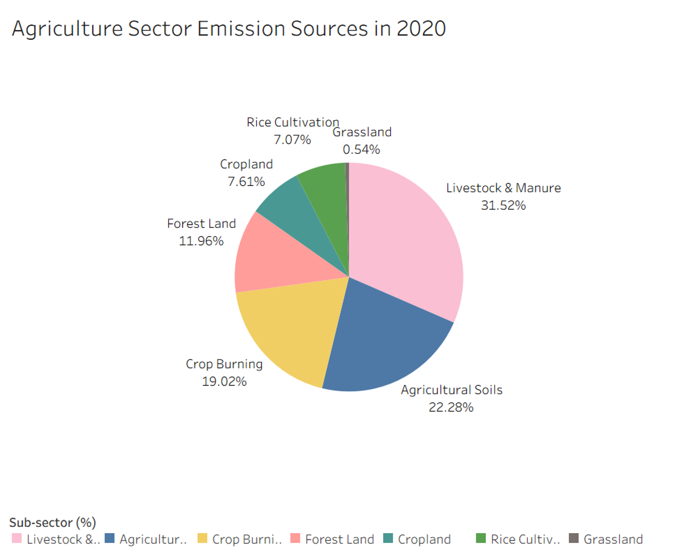

# Telling-Story-Induvidual-Coursework

## Abstract
This paper analyzes global greenhouse gas emissions across major sectors to identify priorities for decarbonization. Using datasets from Our World in Data, the study traces long term emission trends and examines sector and subsector contributions. A structured narrative and a set of refined visualizations guide readers from historical patterns to detailed sources of emissions. The findings show that the energy sector is the largest contributor, that industry and waste emissions are highly concentrated, and that agriculture has a more complex internal structure. An ethics and accessibility review supports the clarity and fairness of the visual design. The results provide a clear foundation for targeted climate mitigation strategies.

## Visualizations

 

## Reference
- Jones et al. (2025) – with major processing by Our World in Data. ``Annual greenhouse gas emissions including land use'' [dataset].
- Global Change Data Lab. (n.d.). Our World in Data. https://ourworldindata.org
